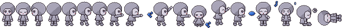

# Making a new character

How to build a **brand-new character** (not a skin of Pyxl) that can drop into PixelPaint. Use the
same small, chunky pixel style as Pyxl and draw the same 18 poses, so every state in the app (idle,
walking, being carried, sleeping, racing) has a frame to show.

For colour swaps and clothing *on Pyxl*, see `docs/PYXL.md` §6 instead.

Every character is a **costume on the mannequin**: Pyxl's body as plain parts, posed like her. The
worked example is **Piton**, a little mountain climber.




---

## 1. Meet Piton

Piton is a small mountaineer who never takes his goggles off his hood. The idea was a classic
snowy-peak climber in the spirit of retro platform heroes. He's drawn in **Pyxl's chibi anime
style** but has his own design:

| Part | What it is | Why |
| --- | --- | --- |
| Hood | A big round fur-trimmed hood, as wide as Pyxl's beret, with a pompom | His "hat": the biggest shape, like her beret |
| Hair | Spiky ginger bangs and side locks spilling out of the hood | Frames the face the way her hair does; ginger sets him apart from her dark hair |
| Eyes | Pyxl-style anime eyes: a dark lash line, iris rows, a white glint, blush under them | The style's signature. The face is small and the eyes are big and wide-set |
| Goggles | **Amber snow goggles** pushed up on the hood, with a strap all round | His signature, readable even from the back |
| Parka | A tiny puffy parka with a fur hem, and pack straps | Keeps him chibi: almost no neck, short limbs |
| Pack | An **orange backpack** with a **yellow coil of rope** | Says "climber" from any side |
| Mittens / boots | Red mittens, brown boots with fur cuffs, dark trousers | Warm accents against the cool parka |
| Mallet | A wooden ice mallet with a steel band | His tool in action poses, standing in for Pyxl's brush |

- **Parka colour:** the hood and parka use Pyxl's **teal smock ramp**, and nothing else on him is
  in the teal band. So in the app they would follow the outfit colour exactly like her smock
  (PYXL.md §4).
- **Pose mapping:** his poses map onto hers by meaning rather than look:
  - `brush` taps the mallet
  - `paint` swings it into ice chips
  - `spray` thrusts it forward
  - `raise` holds it up (the carried pose)

### Matching Pyxl's style (the rules that matter)

Measured from her sheet (`front` is 34 × 53):

- **Head ≈ 3/5 of the height.** The hat and hair are about 29 of her 53 rows, the body about 12
  and the legs about 8. Piton: hood plus face about 31 of 56, parka 13, legs 10.
- **Head as wide as the whole sprite** (34px). The body is about 18px and the arms and legs are
  stubs.
- **A small face, low in the head.** It's a skin window about 16px wide. The eyes sit in the
  lower half of the head with the chin just above the collar.
- **Eyes:** a solid dark lash row on top with a flick at the outer corner, then 3 rows of iris
  (dark at the top, lighter brown at the bottom) with a 1px white glint. Blush goes 2px below the
  outer corners. The mouth is tiny or missing.
- **Hair that breaks the outline:** zigzag bang tips, side locks down past the eyes, darker
  strands, and a light band near the top.
- **A 1px `#221822` outline everywhere, light from the top-left,** and 3-step ramps.

A first attempt used one round "ball" head with dot eyes. It was cute, but it read as a
different art style, because it had no hair, a small face window and tiny eyes. Those features
are what make the style.

## 2. Files

| File | What it does |
| --- | --- |
| `tools/characters/rig.js` | The renderer. Shapes, outline, shading, stamps, rotation and packing |
| `tools/characters/mannequin.js` | **The mannequin.** Pyxl's proportions (`BODY`), the 18 pose skeletons (`SKELETONS`), the face stamps, shared effects, and `figure()` / `poses()` that dress a costume |
| `tools/characters/piton.js` | Piton: a palette and a costume (about 120 lines). No pose code at all |
| `tools/character-builder.html` | Preview page. Pick a character (or the bare mannequin), see the sheet and `SPRITES` table, download both |
| `assets/characters/mannequin-pixel.png` | The bare mannequin in all 18 poses, as a reference sheet |
| `assets/characters/piton-pixel.png` | Piton's sheet: 750 × 59, lossless, 0 semi-transparent pixels |
| `assets/characters/*-sprites.json` | Pose tables, in the same `[x, y, w, h, anchorX, feetY]` form as Pyxl's |

To preview, serve the repo (`python3 -m http.server`) and open `/tools/character-builder.html`.

## 3. How the rig draws

Nothing is hand-placed except the face. A character is a **list of parts drawn back to front**.

1. **A part is a shape.** Each shape is a test that answers "is pixel (x, y) inside?":
   - `ellipse`, `circle`
   - `capsule` (limbs)
   - `rect`, `poly`
   - `box` (a rotated rectangle, used for the mallet head)
   - combined with `and` / `minus`

   For example, the fur ring is `and(furEllipse, hoodEllipse)`, so it never sticks out of the hood.
2. **Outline:** before a part is filled, every pixel touching it on the four sides (not the
   diagonals) gets the outline colour `#221822`, drawn over whatever is behind. That gives:
   - a clean 1px line around the whole character
   - lines between overlapping parts (an arm over the body)
   - slightly rounded corners

   A part can opt out with `outline: false` (straps, the fur hem), or use a softer colour, like the
   face's fur-shadow outline.
3. **Shading:** each part has a material, a ramp of `[shadow, base, light]`, and one of three
   `shade` modes:
   - `round`: a diagonal gradient across the part's box. Light top-left, shadow bottom-right.
     Used for the hood, body, mittens and boots.
   - `edge`: base colour, a light rim on the top-left edge and a shadow rim on the bottom-right.
     Used for limbs and the mallet.
   - `flat`: one colour. Used for the face, straps and ice.
4. **Details:** some parts need hand-drawn pixels.
   - `paint(x, y, k)` gives a part per-pixel colours. The hair uses it for darker strands and a
     light band.
   - `pixels: [[x, y, colour]]` are placed last.
   - `stamp(x, y, rows, legend)` turns little text drawings into pixels. The eyes are drawn this
     way:
     ```js
     open: ['.aaaa',    // a = lash/outline
            'aewee',    // e = dark iris, w = glint
            '.eeie',    // i = lighter iris
            '.eiii',
            '..ii.'],
     ```
     Faces are where single pixels matter, so every expression (`open`, `closed`, `happy`,
     `half`, `wide`) is a stamp. The right eye is the same stamp mirrored.
5. **Packing:** `pack()` crops every pose to its drawn pixels, lays them out in one row 1px apart,
   and writes the anchor table. Each pose is drawn on the same 84 × 68 canvas with the **origin
   between the feet on the floor** (`OX`, `FY`), so `feetY` comes out consistent. `anchorX` is the
   hood centre, which is where the app hangs him when carried, like Pyxl's beret.

## 4. The mannequin

`mannequin.js` is Pyxl reduced to plain parts. You can see it bare in the builder:

- **`BODY`:** her proportions, measured from her sheet.
  - The skull (hair volume) is centred 33px above the feet, 28 × 25px.
  - The face window sits in the lower half of the head.
  - The torso runs from −21 to −9 and tapers from 12px to 18px wide.
  - Arms are 1.9px capsules, hands 2.1px, and legs 2px.
- **`SKELETONS`:** the 18 poses as data. They copy Pyxl's poses by measuring where her head,
  hands and feet are in each one:
  ```js
  brush:  { view: 'side', feet: [[-6, 0], [5, 0]], hands: [[-5, -11], [16, -21]], tool: { hand: 1, angle: -50 } },
  drowsy: { view: 'side', legs: 'sitSide', headDy: 1, eyes: 'closed', mouth: 'none', fx: [['doze', 22, -30]] },
  sleep:  { view: 'front', lie: true, eyes: 'closed' },
  ```
  - `view` is front, side (facing right) or back. The left-facing `side` pose is a mirror.
  - Hands and feet are positions measured from the floor point between the feet. The arm and leg
    capsules connect them to the shoulders and hips.
  - `bob` lifts the whole body, e.g. for breathing or the `cheer` jump.
  - `legs` can be `sit` (front) or `sitSide`, and `lie` turns the standing pose a quarter turn.
  - `tool` says which hand holds the prop, and at what angle.
  - `eyes` / `mouth` set the expression, and `fx` adds effects (splat, spray, note, sweat, doze).
- **House rules built in:**
  - Pyxl-style eye stamps, blush and a tiny mouth.
  - Draw order: things behind, far arm, legs, torso, head, face, hair, hat, near arm and tool,
    effects.
  - A hand raised above the shoulders in side view goes **behind** the head, so an arm never
    crosses the face.

### A costume fills slots

Every slot is optional. A missing one falls back to the plain mannequin.

| Slot | What it gets / returns | Piton uses it for |
| --- | --- | --- |
| `skin`, `iris`, `eye`, `blush`, `mouth` | colours | ginger-brown eyes |
| `skull(g)` | the head's big shape | the hood |
| `faceFrame(g)`, `faceClip(g)`, `faceOutlineColour` | around / limits of the face window | the fur ring |
| `hair(g)` | drawn over the face window | spiky bangs and side locks |
| `hat(g)` | drawn last on the head | pompom, goggles and strap |
| `torso(g)` | the body | parka, fur hem, pack straps |
| `behind(g)` | before everything | backpack and rope (side view) |
| `sleeve`, `handMat` / `hand(g, i, far)` | arms and hands | parka sleeves, red mittens |
| `legs` / `foot(g, foot, far)` | legs and feet | trousers, fur-cuffed boots |
| `tool(x, y, angle, g)` | the held prop | the ice mallet |
| `fx: { splat, spray, … }` | replace an effect | ice chips instead of paint |
| `front(g)` | after everything | — |

`g` describes the pose being dressed:

- `g.v` (the view) and `g.sk` (the skeleton)
- `g.head` `{x, y, rx, ry, shape}` and `g.face` `{x, y, shape}`
- `g.torso` `{top, bot, shape}`
- `g.hands`, `g.feet`, `g.hips` and `g.shoulders`
- `X()` / `Y()` to place things from the origin

A slot just returns rig parts, so it can't break the poses. That's why Piton has no pose code.

## 5. Making your own character

1. **Copy `piton.js`** to `tools/characters/<name>.js`, rename it, and clear the costume down to
   a few slots. Open the builder on the bare **mannequin** to see what you're dressing.
2. **Silhouette first:** `skull` (hair mass, hood or helmet), `hat` and `torso`. The mannequin
   already has the proportions. Keep big shapes about the size of the skull, so the head stays
   about 3/5 of the height.
3. **Hair and eyes next.** They carry the style. Use bangs and locks that break the face outline,
   and Pyxl-style eye stamps.
4. **Palette:** one `[shadow, base, light]` ramp per material, with:
   - clear brightness steps
   - shadows shifted slightly warm or purple rather than just darker
   - the outline `#221822`

   Use the **teal ramp** for whatever should follow the outfit colour, and keep everything else out
   of hue 150–205.
5. **A signature detail** that shows from every side (Piton's goggles and pack). This is what makes
   a character more than a recolour.
6. **Check every view.** A slot runs in all three views (`g.v`). Get `front` right, then check
   the `side` poses (the walk cycle) and `back`. The poses themselves come free.
7. **Add it to the builder:** one line in `CHARS` in `tools/character-builder.html`.
8. **Look at it at 1× and zoomed, next to Pyxl.** Things that commonly go wrong:
   - details that sit outside the silhouette: clip them with `and(...)`, e.g. Piton's face is
     clipped to his hood
   - something that should be behind showing in front: move it to `behind`, or check `g.v`
   - a pose that's wrong for **every** character: fix its skeleton in `mannequin.js`, and every
     character gets the fix
9. **Download the sheet and table**, put them in `assets/characters/`, and run the checklist in
   PYXL.md §7: lossless, no semi-transparent pixels, one outline colour, anchors match.

## 6. Putting a character in the app (not built yet)

The sheet and table have the same shape as Pyxl's, so wiring one in means:

- teaching `Mascot` to take a sheet and `SPRITES` table per character, instead of the one in
  `js/ui/mascot.js`
- letting an egg or the Shop pick which character hatches

His poses use the same names, so the states, the walking, carrying, throwing, sleeping and racing
need no changes. Ask and it can be added.

## 7. Other ways to make pixel art with Claude (for reference)

- **[pixel-mcp](https://github.com/willibrandon/pixel-mcp):** an MCP server that lets Claude
  drive **Aseprite**.
  - Drawing tools: pixels, shapes, layers, frames and animation tags.
  - Art tools: dithering, palette reduction and automatic shading.
  - Sprite-sheet export with JSON.
  - Needs Go and a copy of Aseprite, and runs on your own computer.
- **[pixel-art-lab](https://github.com/nbrown725/pixel-art-lab):** a local web app built on
  pixel-mcp.
  - The model draws, renders a preview, looks at it and fixes problems in a loop, with undo
    checkpoints and limits on spending.
  - Needs Aseprite and an OpenRouter key.
- **Text-to-sprite renderers:** the approach used here (code or ASCII drawn into pixels) is also
  what many people building games with Claude use.
- **Local image models:** e.g. the
  [SD PixelArt SpriteSheet Generator](https://huggingface.co/Onodofthenorth/SD_PixelArt_SpriteSheet_Generator)
  (Stable Diffusion). Output is rough and needs a clean-up pass, and it won't match Pyxl's exact
  palette or poses.

The rig here was chosen because it needs nothing installed. It's also deterministic, so the same
code gives the same sheet every time, and every pose stays editable as code.
